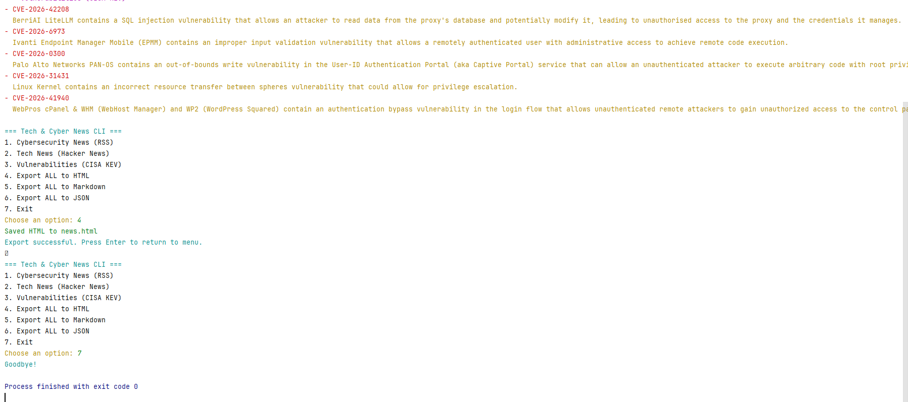

# 📰 Tech & Cyber News Fetcher (Python)

A lightweight Python script that fetches the latest **technology** and **cybersecurity** headlines from reliable, public RSS feeds.  
This project demonstrates:

- API consumption (RSS + JSON)
- XML parsing
- JSON parsing
- Clean Python structure
- Real‑world data handling
- Cybersecurity + tech domain relevance

No API keys required.

---

## 🔗 News Sources

This script uses **four stable, publicly available feeds**:

- **The Hacker News**  
  https://feeds.feedburner.com/TheHackersNews

- **Krebs on Security**  
  https://krebsonsecurity.com/feed/

- **Dark Reading**  
  https://www.darkreading.com/rss.xml

- **CISA Cybersecurity Advisories**  
  https://www.cisa.gov/cybersecurity-advisories/all.xml

Additionally, the script fetches the latest **CVE vulnerabilities** from the CIRCL API:

- **CVE Feed (JSON)**  
  [https://www.cisa.gov/sites](https://www.cisa.gov/sites/default/files/feeds/known_exploited_vulnerabilities.json)

These sources provide a broad, reliable snapshot of current events in cybersecurity and technology.

---

## 📁 Project Structure
```text
news-fetcher/
│
├── news_fetcher.py
├── README.md
├── requirements.txt
├── .gitkeep
│
├── assets/
│   |── cli_screenshot.png
|   |── news_html.png
|   |── news_json.png
│
|── samples/
|   ├── sample_output.md
|   ├── sample_output.html
|   └── sample_output.json
```


---

## ▶️ How to Run

Install dependencies (only `requests` is needed):

```bash
pip install requests
```

Run the script:
```bach
    python news_fetcher.py
```

You will see output similar to:
```bach
=== Tech & Cyber News ===
Updated: 2026-05-11 19:00

The Hacker News – Latest Headlines:
----------------------------------
- Example headline
  https://example-link.com
```


🧠 How It Works
1. RSS Fetching
The script downloads RSS feeds and extracts:
- Title
- Link
- Publication date

2. Vulnerability Feed
The script fetches the latest known vulnerabilities.

3. Error Handling
If a feed is unavailable, the script prints a clean error message and continues.


## 📸 Example CLI Output

Below is a real screenshot of the tool running:



